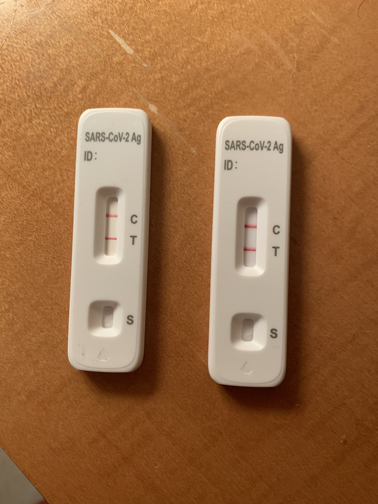
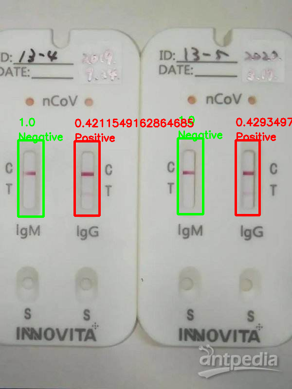

# AntigenClassifier

Deep Learning Model to classify the antigen image

## Features

- [x] Classify antigen image and give pos/neg posibility
- [ ] Classify 北京健康宝

## Quick Start

* Clone Repo

```shell
git clone https://github.com/ShanghaiITVolunteer/AntigenClassifier
```

* Build Docker Image

```shell
make build
# or
docker build -t antigen-classifier:0.1 .
```

* Run Docker Container

```shell
make run
# or
docker run -it -d -v $(PWD)/:/antigenclassifier/ -p 8089:8089 --restart=always --name=antigen-classifier antigen-classifier:0.1
```

## Screen Shot

* input



* output



## Contributors

<a href="https://github.com/ShanghaiITVolunteer/AntigenClassifier/graphs/contributors">
  
</a>

Made with [contrib.rocks](https://contrib.rocks).

## Copyright & License

- Code & Docs © 2022 ShangHai Volunteer <https://github.com/ShanghaiITVolunteer>
- Code released under the Apache-2.0 License
- Docs released under Creative Commons